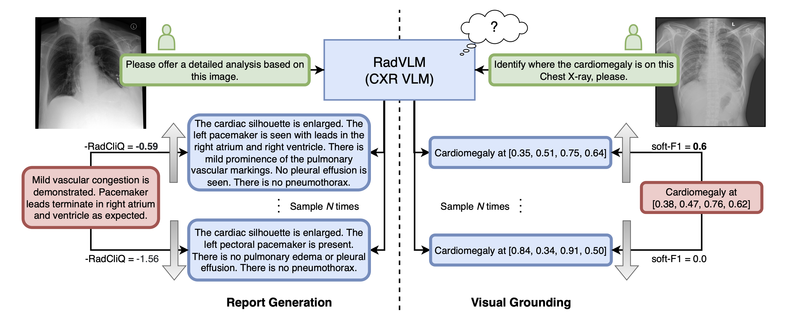
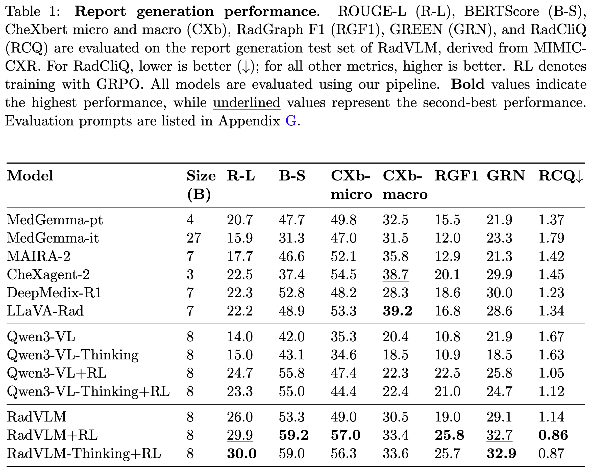
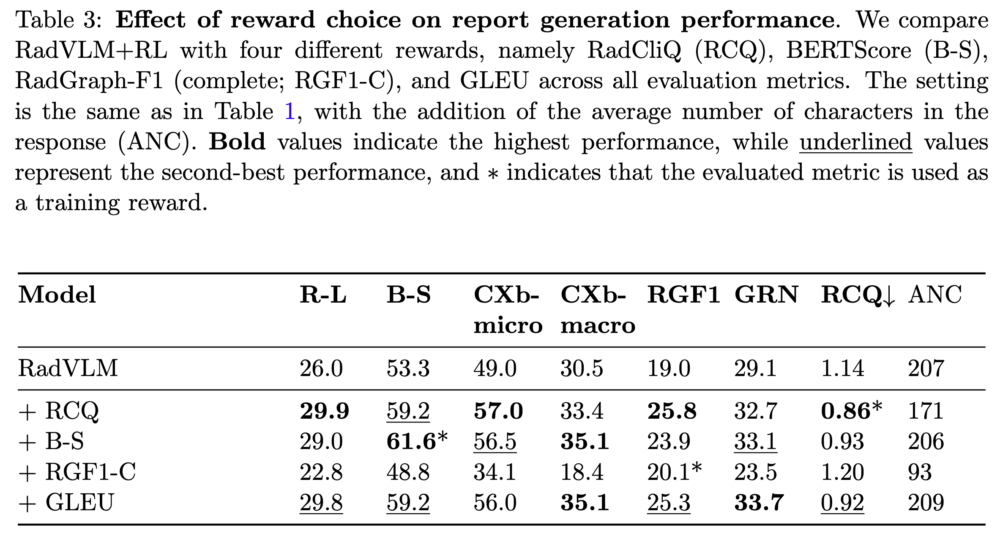
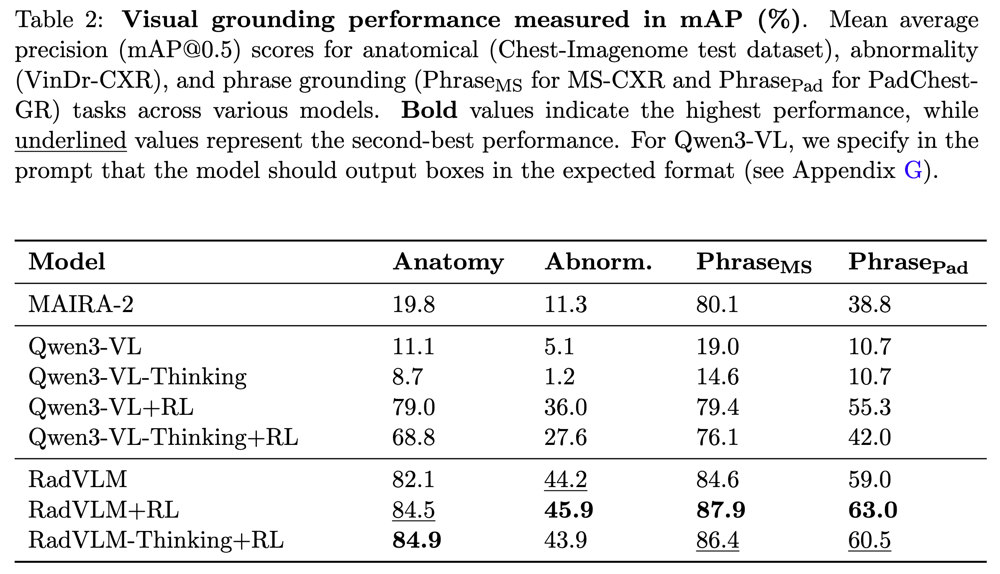

# RadVLM-GRPO

## Overview


## Results
### Report Generation
#### Performance


#### Rewards


### Visual Grounding
#### Performance


## Code
We provide the code. Please keep in mind that this code is specific to clariden (Alps / CSCS [CSCS docs](https://docs.cscs.ch/) ) and slurm, so depending on your hardware / software you might change things.
### Overview
Some subdirectories have their own README.md for further information.
```bash
docker/Dockerfile
docker/pip_freeze.txt # output from "pip freeze"

images/ # Some images that are shown in this md.

RadEval/RadEval/factual/RadCliQv1/ # Code for RadCliQ

RadVLM/ # Evaluation code

repos_deps/GREEN # Code for GREEN repo in case you want to eval it, pip install it first

repos_deps/LLaVA-Rad # Code for LLaVA-Rad repo in case you want to eval it, pip install it first

verl/ # RL training code

# TODO llama factory
```


### Dockerfile
We provide the dockerfile we use to run our experiments, tested on GH200 on clariden (CSCS alps):
```
docker/Dockerfile
```
If you need to create some other way of running it feel free to create it.

The output of:
```
pip freeze
```
is listed in 
```
docker/pip_freeze.txt
```

### Dependencies

We use these repos RadVLM, verl, LLama Factory, RadEval, GREEN, llava-rad (to evaluate this model you need to build your own environment based on the versions they list in their repo). We provide (modified) snapshots of these repos in this repo.

here are the respecive paths:
```
RadVLM/
verl/
# TODO llama factory
RadEval 
```

You might have to install some of these repos when running specific code i.e.

When evaluating with RadVLM and use vllm for inference, we use the verl dataloader to process the data so you need to:

```
cd verl/
pip install -e .
```

When using RadCliQ you need to install RadEval.
```
cd RadEval/
pip install -e .
```

For GREEN
```
cd repos_deps/GREEN
pip install -e . --no-deps
```

Feel free to also set up your environment directly with everything installed.


### GRPO training

see 

```
verl/README.md
```

### RadVLM evaluation

see

```
RadVLM/README.md
```

# Acknowledgments

This work was supported as part of the Swiss AI Initiative by a grant from the Swiss
National Supercomputing Centre (CSCS) under project ID a135 on Alps. BG received
support from the Swiss National Science Foundation (SNSF) grant 10003518. ND received
support from RADICAL (Project-Call 2024.1, ID:9), funded by the DIZH

# Licensing

This repo contains components under multiple licenses.

- Files in RadVLM/ are licensed under Attribution-NonCommercial 4.0 International
- Files in LLaMA-Factory/ are licensed under Apache License 2.0
- Files in verl/ are licensed under Apache License 2.0
- Files in RadEval/ are licensed under MIT License

We will update this part soon, since CC isnt really a software / code license.

Default License:
Unless a subdirectory contains its own LICENSE file, all other files in this
repository are licensed under the Creative Commons Attribution-NonCommercial 4.0 International License (CC BY-NC 4.0).

Subdirectory Licensing:
If a subdirectory includes its own LICENSE file, that license governs all files
within that subdirectory and overrides the default license for those files.

File Licensing:
If an individual file contains an explicit license notice, that file's notice
takes precedence over both the default license and the subdirectory license.

Please refer to the LICENSE files in each directory for terms and licenses in the files themselves.
